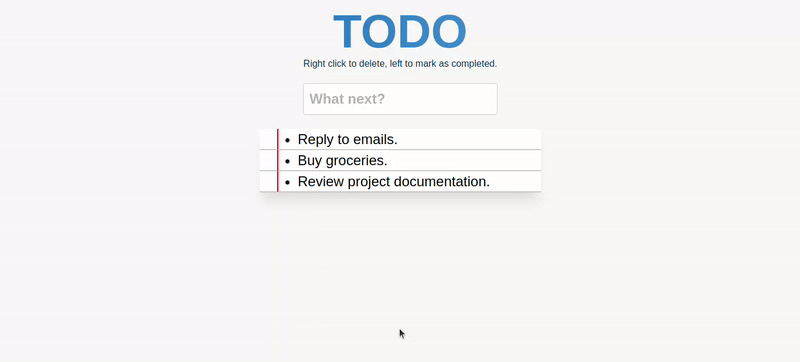

# to-do-list-web-application.
to-do list web application. The application allows users to add, remove, and mark tasks as completed. It features a clean and minimalistic user interface

*The application supports local storage to save tasks, ensuring persistence even after page reloads.  
*Users can input new tasks in the provided text box.  
*Tasks are displayed in a list format, with options for deletion and completion.  
*Completed tasks are visually distinguished with a line-through text style.  

